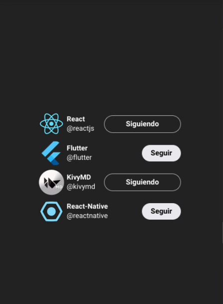

# Clonación de Twitter Follow Card en React ⚛
¡Bienvenido al repositorio de la clonación de la Twitter Follow Card en React! Este repositorio es un demo de conocimientos sobre componentes, props y state en React. Aquí, podrás encontrar todos los detalles necesarios para que puedas entender cómo funciona nuestra implementación.

## ¿Qué es la Twitter Follow Card?
La Twitter Follow Card es una tarjeta que aparece en Twitter para seguir a una cuenta. Esta tarjeta muestra información sobre la cuenta que te sigue, como su nombre, foto de perfil y nombre de usuario.

> imagen de la recreacion del componente

## ¿Cómo funciona nuestra implementación?
Nuestra implementación es una clonación fiel de la Twitter Follow Card en React. Para lograr esto, utilizamos los siguientes elementos:

 * **Componentes**: Utilizamos componentes de React para dividir la interfaz de usuario en piezas más pequeñas y manejables.
* **Props**: Utilizamos props para pasar datos entre los componentes y personalizar su comportamiento.
* **State**: Utilizamos state para manejar el estado de los componentes y actualizar la interfaz de usuario en respuesta a eventos.

## Conclusión
En resumen, este repositorio es una clonación de la Twitter Follow Card en React. Utilizamos componentes, props y state para lograr una implementación fiel de la tarjeta. Puedes correr este proyecto en tu computadora o utilizar los componentes en tu propio proyecto. ¡Esperamos que te sea útil! 😎
